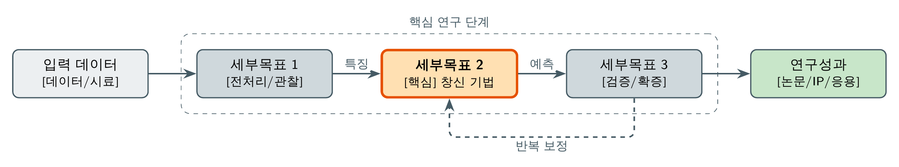
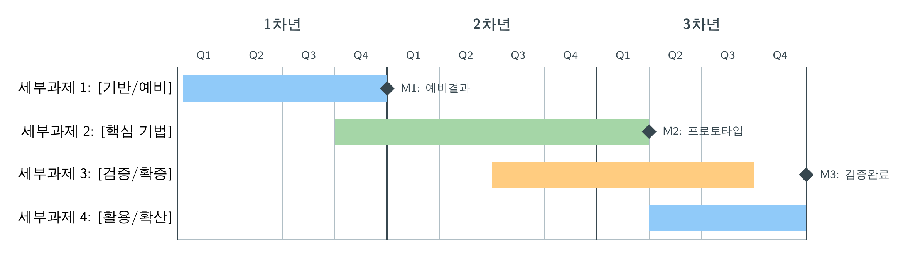

<div align="center">

# 🇰🇷 NRF 연구계획서 Copilot


### **선정되는** 한국연구재단(NRF) 연구계획서를 써 주는 AI **Skill** — 챗봇이 아니라 노련한 책임자(PI)처럼.

[](#-설치)
[](LICENSE)
[](#)
[](#-대상-사업)

*기획 → 실시간 분야 조사 → 논리 설계 → 한글 초안 → 그림 생성 → 심사 패널 시뮬레이션 → 내보내기.*

**한국어** · [English](README.en.md)

</div>

---

> **연구계획서, 이제 혼자 쓰지 마세요.**
> 이 Skill은 문장만 다듬지 않습니다. **실제 검색**으로 국내외 연구 동향을 인용 가능한 논문으로 채우고,
> 심사위원이 채점하는 방식대로 논리를 설계하며, 추진체계도와 간트차트를 그리고, **HWP(한글)** 문서를
> 읽고 내보내며, 마지막에 **NRF 심사 패널을 역할극으로 시뮬레이션**해 제출 전에 약점을 깨뜨립니다.

> ### 책임 있는 사용 — 먼저 읽어주세요
> NRF를 비롯한 대부분의 지원기관은 **AI가 작성한 계획서 제출을 금지**하며, 본문은 신청자 본인의 학술적
> 표현입니다. **제작자로서 우리는 AI로 계획서를 써서 그대로 제출하는 것을 권장하지 않습니다.** 이
> 도구는 **학습·참고용**입니다 — 우수한 계획서의 *구조와 글쓰기 스타일*을 배우고, 자료를 조사하고,
> 계획을 시각화하고, 심사위원 관점에서 초안을 점검하기 위한 것입니다. 모든 산출물은 **본인의 목소리로
> 다시 쓰고 검증할 초안**으로 다루세요 — 연구 내용과 최종 문장은 신청자 본인의 것이어야 합니다.

## 왜 필요한가

NRF 선정률은 약 10~30%. 서면평가 위원은 비슷한 과제 5~9건을 보고 **몇 분 안에** 판단하며, 흔히 *세부
전공자가 아닌 유능한 동료*입니다. 선정 계획서는 거의 공개되지 않아 일반적인 '글쓰기 팁'으로는 부족합니다.
이 Skill은 실제로 점수를 움직이는 것을 코드화했습니다.

- 🎯 **배점 기반 설계** — 창의성·도전성이 점수의 **40~50%**. 분량과 논리 에너지를 습관이 아니라 거기에
  집중시킵니다.
- **느낌이 아니라 근거** — 연구 동향을 OpenAlex·Semantic Scholar·Crossref·arXiv + 국내
  ScienceON·KCI·RISS **실시간 검색**으로 구성하고, 모든 주장에 해결 가능한 DOI를 붙입니다. **인용 날조 절대 금지.**
- **심사위원의 머리를 내장** — 심사위원 7가지 질문, 사업별 실제 배점, 실제 탈락 사유 목록이 집필과
  **3인 패널 시뮬레이션**을 이끕니다.
- **두 쪽 모아찍기에도 읽히는 그림** — 한글 추진체계도·간트차트·개념도(출판급 TikZ). 심사위원이 두
  쪽씩 모아 인쇄해 보기 때문입니다.
- **재작업 방지 체크포인트** — 10쪽을 쓰기 **전에** 연구공백과 논리 골격을 함께 확정합니다.
- **3인 심사 패널 시뮬레이션** — Nature 심사 skill을 본떠 세부전공자·외부동료·회의론자가 공식 배점으로
  채점하고, 점수 영향순 수정 목록으로 약한 축을 끌어올립니다. (데이터·인용·심사위원 신원 날조 없음.)
- 📄 **HWP(한글) 입력 + HWP 출력** — 공식 `.hwp` 양식/공고/샘플을 읽고(한글 파일명 정규화 버그까지
  처리), 제안서를 **실제 HWP 파일(`.hwpx`)로 직접 작성**합니다. PDF로 변환하지 않습니다. `.hwpx`는
  한글(Hancom)이 바로 열고 `.hwp`로 저장할 수 있으며, 표·그림·제목 서식까지 담깁니다.
  *드론·AI 예시로 검증: validate 0 issues, 그림 3개 내장.*
- **날조 없는 웹 근거** — 기대효과/사업화용 시장규모·경쟁사·정책·뉴스를 모든 사실마다 해결 가능한
  URL + 날짜로 고정합니다.
- **RFP/공고 → 과제 아이디어** — 하드 제약(품목·TRL·예산·기간·평가배점)을 추출해 위반 아이디어는
  걸러내고, **공고 적합도·신규성·feasibility·역량 매칭** 4축으로 채점·랭킹. (LLM 아이디어는 "참신하나
  실현성↓" 경향 → feasibility와 공고 적합도에 집중.)
- **비주얼 자산 계획** — 텍스트만이 아니라 "여기엔 산불 현장 뉴스 사진, 여기엔 실험실 장비 사진,
  여기엔 개념도" 처럼 **무엇을 어디에** 넣을지 제안하고, 만들 수 있는 건 생성·나머지는 [비주얼 자리]로 표시.
- **TikZ + matplotlib 그림** — 박스·화살표(추진체계도/간트차트)는 TikZ, 데이터 차트(성능 비교·TRL
  로드맵·차별성 레이더)는 matplotlib로 한글까지 깔끔하게 생성.
- **올바른 글꼴** — `.hwpx`는 한글(Hancom)이 자체 글꼴(함초롬바탕 등)로 렌더링하므로, PDF 변환에서
  생기던 글꼴 깨짐·혼용 문제가 없습니다.

## 실제 그림을 그립니다 (자동 생성·한글)

| 추진체계도 (연구 프레임워크) | 간트차트 (연차별 일정) |
|:---:|:---:|
|  |  |
| *창신 모듈 강조 — 창의성 점수를 시각적으로 주장* | *마일스톤 + 연차별 막대, 추진전략의 필수 그림* |

번들 `.tex` 템플릿에서 한 번에 생성한 뒤 `.tex` + 고해상도 PNG/PDF로 돌려드려 HWP/Word에 바로 삽입.

## 7단계 워크플로

```
0 라우팅·인테이크 → 분야(이공/인문사회) + 사업 + 2026 IRIS 명칭 + 당신의 .hwp 양식/공고 읽기
1 연구 현황 조사 → 다중 출처 실시간 검색 → 인용 포함 동향 정리 → 연구공백 문장
2 논리 골격 설계 → Claims–Aims–Evidence 매트릭스 + SMART 목표 + 차별성표 + 분량 배분
3 본문 집필 → 배점 차원에 맞춘 섹션별 한글 초안
4 그림·도식 생성 → 추진체계도 · 간트차트 · 개념도 (TikZ 컴파일·미리보기)
5 평가 시뮬레이션 → 3인 패널이 공식 배점으로 채점 → 점수 영향순 수정 → 재채점
6 제출 전 점검·HWP 출력 → 분량/형식 + IRIS·NRI 사전준비 + (인문사회) 무기명 · → .hwpx(HWP)
```

주(Note): 사용자 확인 필수 체크포인트. 1쪽 골격을 고치는 건 싸지만, 10쪽을 다시 쓰는 건 비쌉니다.

## 대상 사업

2026 **IRIS** 체계·명칭에 맞춰 라우팅하고(구 명칭은 별칭으로 유지):

| 분야 | 사업 (2026) | 구 명칭 |
|---|---|---|
| 이공 (과기정통부) | **신진연구**, **핵심연구** (유형C/B/A·도약형), **리더연구**, **세종과학펠로우십**, 기본연구, 한우물파기 | 우수신진, 중견연구 … |
| 인문사회 (교육부) | **신진/중견/우수학자**, 학술연구교수 | — *(무기명 평가 적용)* |

분량 한도·자격 요건·**정확한 배점**은 [`references/`](references/)에 있습니다.

## 설치 및 사용

먼저 한 번 클론하세요:

```bash
git clone https://github.com/geumjin99/nrf-proposal-skill.git
```

이 skill은 Markdown 플레이북(`SKILL.md` + `references/`)과 보조 `scripts/`로만 이루어져 있어,
**지시문을 읽는 모든 에이전트**에서 동작합니다. 대표적인 두 가지 방법:

### Claude Code (네이티브 Skill)

[Claude Skill](https://docs.claude.com/en/docs/claude-code/skills)입니다. Claude Code가 skill을
불러오는 경로에 넣으면 NRF/연구계획서를 언급할 때 **자동으로 로드**됩니다:

```bash
# 전역(모든 프로젝트):
cp -r nrf-proposal-skill ~/.claude/skills/nrf-proposal
# 또는 프로젝트별:
cp -r nrf-proposal-skill ./.claude/skills/nrf-proposal
```

### Codex CLI / Cursor / Cline / Gemini CLI (AGENTS.md 계열)

네이티브 skill 로더가 없으므로, 플레이북을 직접 가리켜 주면 됩니다. 폴더를 프로젝트 안(또는 옆)에
두고 `AGENTS.md`(Codex)에 아래 한 줄을 추가하거나, 대화에서 따르라고 말하면 됩니다:

```markdown
## NRF 연구계획서
사용자가 한국연구재단(NRF) 연구계획서 기획/작성을 요청하면
`./nrf-proposal-skill/SKILL.md`와 `references/`의 플레이북을 따르고, `scripts/`의 보조 스크립트를 사용한다.
```

### 그리고 말만 걸면 됩니다

> "신진연구 계획서 쓰고 싶어. 주제는 그래프 신경망 기반 단백질 상호작용 예측이야."
> "nrf-proposal-skill/SKILL.md를 따라서 핵심연구 계획서를 …(주제)… 로 도와줘."

### 선택 의존성 (그림·검색 도구용)

| 기능 | 필요 | 설치 (Debian/Ubuntu) |
|---|---|---|
| TikZ 그림(한글) | XeLaTeX + 한글 폰트 | `sudo apt install texlive-xetex texlive-latex-extra texlive-lang-korean fonts-noto-cjk` |
| PDF→PNG 미리보기 | poppler **또는** ImageMagick | `sudo apt install poppler-utils` |
| 문헌 검색 | Python 3 (표준 라이브러리만) | 기본 제공 |
| 데이터 차트 | matplotlib | `pip install matplotlib` |
| HWP(한글) 읽기 | pyhwp | `pip install pyhwp` |
| HWP(.hwpx) 쓰기 | python-hwpx | `pip install python-hwpx` |

문헌 정찰은 무료·무키 API만 사용합니다:

```bash
python3 scripts/search_papers.py "그래프 신경망 단백질 상호작용" \
        --email you@example.com --limit 12 --since 2021 --oa
```

## 저장소 구조

```
nrf-proposal/
├── SKILL.md # 에이전트의 플레이북 (7단계)
├── references/ # NRF 지식 베이스 (사업·구조·배점·검색·HWP …)
├── templates/ # 한글 계획서 골격 + Claims-Aims 매트릭스 + .tex 그림
├── scripts/ # search_papers · check_proposal · compile_tikz · make_figure_mpl · hwp_tools(읽기) · write_hwpx(쓰기)
└── assets/ # 예시 그림 + README 이미지 프롬프트
```

## 하는 것 / 하지 않는 것

- 심사 기준에 맞춰 구조화·자료조사·집필·시각화·사전 검증.
- 검증 가능한 논문으로 동향 섹션 구성, 검증 불가한 것은 모두 `[VERIFY]`로 표시.
- "선정 보장" 약속, 결과 날조, 인용·수치 조작, 가짜 '선정 샘플' 제공은 **하지 않습니다.** 도구의
  한계를 솔직히 말합니다.

## 출처 및 감사

공식 NRF 신청요강·연구계획서 양식, 문우경 《성공적인 연구계획서 작성법》(2022), NRF 웹진, 대학 산학협력단
가이드 기반. TikZ 그림 방식은 [`research-figure`](https://github.com/chingswy/Skill-Research-Figure)
skill에서, 3인 심사 패널 시뮬레이션은 [`nature-skills`](https://github.com/Yuan1z0825/nature-skills)의
`nature-reviewer` skill을 본떴습니다 — 두 제작자께 감사드립니다. **제출 전 대상 사업 신청요강을 반드시
다시 확인하세요** — 양식·규정은 매년 바뀝니다.

## 함께 만들기 — 공개 프로젝트

이 저장소는 **누구나 함께 만드는 공개 프로젝트**를 지향합니다. NRF 규정·양식·배점은 **매년 바뀌고**,
한 사람이 끝까지 최신으로 유지하기 어려운 영역이라 더욱 그렇습니다. 특히 다음 기여를 환영합니다:

- **사업별 평가표·배점 업데이트**, 인문사회 개인연구사업 평가표 보강 (열린 TODO).
- **HWP(.hwpx) 서식·레이아웃 충실도 개선** (현재 진행 중인 과제 — 정렬/표/양식 일치).
- 실제 사례, 참고문헌 수정, 새로운 검색 소스, 번역.

[`CONTRIBUTING.md`](CONTRIBUTING.md)를 읽고 이슈/PR을 열어주세요. 작은 수정도 환영합니다. 화이팅!

## 라이선스

[MIT](LICENSE). 기여 환영 — 특히 사업별 평가표 업데이트와 실제 예시.

<div align="center">
<sub>계획서 양식과 씨름하기보다 연구를 하고 싶은 연구자를 위해. · 화이팅! </sub>
</div>
